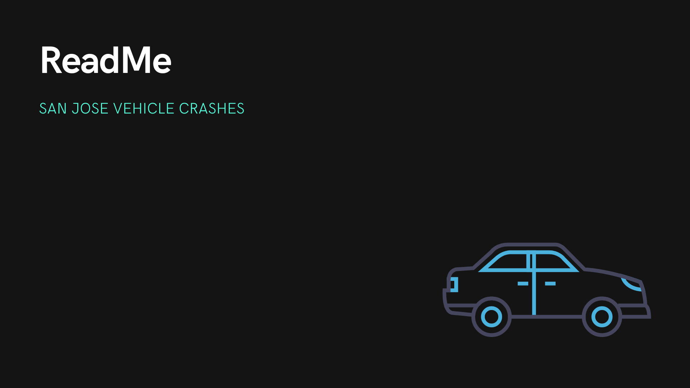
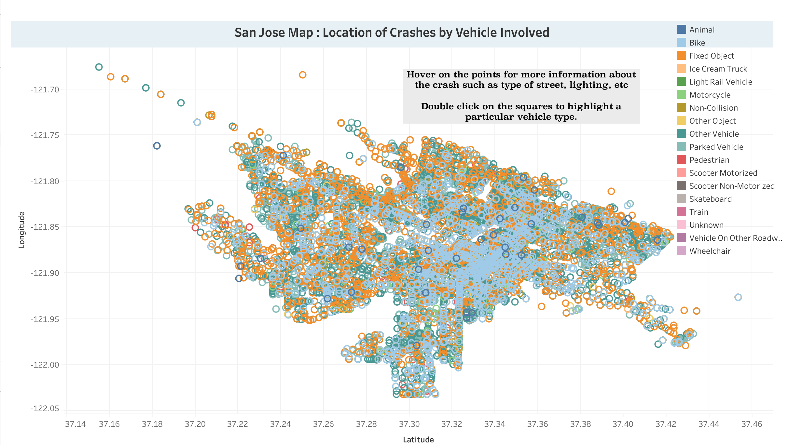

## Vehicle Crashes in San Jose (2014 to 2019)

Vehicle crashes explored visually through Tableau Public. Several dashboards are combined into a story format. 

Dataset obtained from [San Jose CA Open Data Portal](https://data.sanjoseca.gov/dataset/crashes-data)

## Tableau Visualization of the Vehicles Involved

The square colors indicate the type of object involved in the crash.

## Project Dashboard Link

[Tableau Public Story Link](https://public.tableau.com/app/profile/lavanya.santhosh/viz/SanJoseCrashes/StorySJCrashes)
